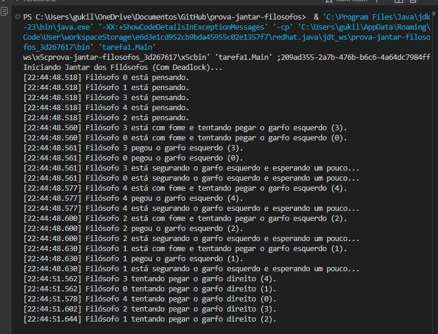
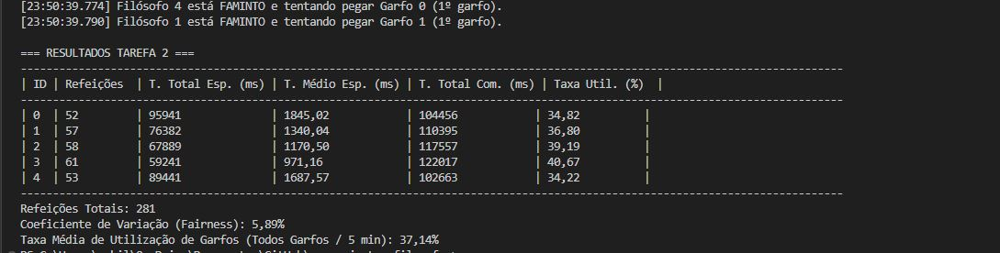
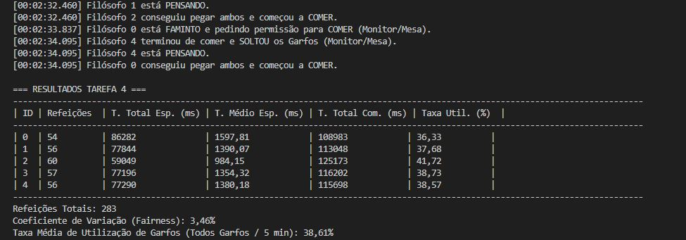

# RELATÓRIO COMPARATIVO - Jantar dos Filósofos (Tarefa 5)

## 1. Introdução

Este relatório apresenta a análise comparativa de quatro implementações distintas para o problema clássico de concorrência "Jantar dos Filósofos". O objetivo foi avaliar mecanismos de sincronização em Java, focando na prevenção de *deadlock* e na análise de métricas de desempenho (*throughput*) e justiça (*fairness*).

### Metodologia
* **Ambiente:** Execução local (JVM).
* **Configuração:** 5 Filósofos, 5 Garfos. Tempos de pensar/comer aleatórios (1-3s).
* **Duração dos Testes:** 5 minutos (300.000 ms) para as Tarefas 2, 3 e 4.
* **Métricas:** Total de refeições, Tempo médio de espera, Taxa de utilização e Coeficiente de Variação (CV).

---

## 2. Análise da Tarefa 1: Implementação Ingênua (Deadlock)

### Descrição
Nesta abordagem, cada filósofo tenta adquirir o garfo da esquerda e, sucessivamente, o da direita. Não há controle de acesso ou ordenação de recursos.

### Resultado: FALHA (Deadlock)
O sistema entrou em estado de *Deadlock* poucos segundos após o início.
Como evidenciado no teste, todas as threads ficaram bloqueadas no estado "tentando pegar o garfo direito", criando uma dependência circular onde ninguém conseguia progredir.

---

## 3. Análise da Tarefa 2: Prevenção por Hierarquia (Quebra de Simetria)

### Descrição
Para prevenir o *deadlock*, o último filósofo (ID 4) inverte a ordem de aquisição dos recursos (pega primeiro a Direita, depois a Esquerda).

### Resultados (5 Minutos)

| ID | Refeições | T. Médio Espera (ms) | Taxa Util. (%) |
|:--:|:---------:|:--------------------:|:--------------:|
| 0 | 52 | 1845,02 | 34,82 |
| 1 | 57 | 1340,04 | 36,80 |
| 2 | 58 | 1170,50 | 39,19 |
| 3 | 61 | 971,16 | 40,67 |
| 4 | 53 | 1687,57 | 34,22 |

* **Total de Refeições:** 281
* **Fairness (CV):** 5,89%
* **Utilização Média:** 37,14%

> **Análise:** A solução preveniu o *deadlock* com sucesso. Entretanto, apresentou a **pior justiça** (CV de 5,89%), demonstrando que a inversão de ordem favorece o filósofo 3 (61 refeições) e penaliza o 0 (52 refeições).

---

## 4. Análise da Tarefa 3: Solução com Semáforos (Limitação de Recursos)

### Descrição
Um semáforo (`Semaphore`) limita o acesso à mesa a no máximo 4 filósofos simultâneos.

### Resultados (5 Minutos)

| ID | Refeições | T. Médio Espera (ms) | Taxa Util. (%) |
|:--:|:---------:|:--------------------:|:--------------:|
| 0 | 57 | 1241,19 | 38,47 |
| 1 | 56 | 1146,88 | 39,62 |
| 2 | 56 | 1299,43 | 37,00 |
| 3 | 56 | 1494,29 | 35,92 |
| 4 | 56 | 1489,86 | 35,22 |

* **Total de Refeições:** 281
* **Fairness (CV):** 0,71%
* **Utilização Média:** 37,25%

> **Análise:** Esta foi a solução **mais justa** (CV de apenas 0,71%). A limitação de lugares suavizou a competição, permitindo que todos comessem praticamente o mesmo número de vezes.

---

## 5. Análise da Tarefa 4: Solução com Monitores (Fairness)

### Descrição
Utiliza um Monitor (`Mesa`) que gerencia estados (`PENSANDO`, `FAMINTO`, `COMENDO`) e coordena as threads com `wait()` e `notifyAll()`.

### Resultados (5 Minutos)

| ID | Refeições | T. Médio Espera (ms) | Taxa Util. (%) |
|:--:|:---------:|:--------------------:|:--------------:|
| 0 | 54 | 1597,81 | 36,33 |
| 1 | 56 | 1390,07 | 37,68 |
| 2 | 60 | 984,15 | 41,72 |
| 3 | 57 | 1354,32 | 38,73 |
| 4 | 56 | 1380,18 | 38,57 |

* **Total de Refeições:** 283
* **Fairness (CV):** 3,46%
* **Utilização Média:** 38,61%

> **Análise:** Apresentou o **melhor desempenho** geral (283 refeições) e a maior taxa de utilização de recursos (38,61%). O uso proativo de `notifyAll` reduziu o tempo ocioso dos garfos.

---

## 6. Conclusão Comparativa

| Métrica | Tarefa 2 (Hierarquia) | Tarefa 3 (Semáforos) | Tarefa 4 (Monitores) |
| :--- | :---: | :---: | :---: |
| **Prevenção de Deadlock** | Sim | Sim | Sim |
| **Total de Refeições** | 281 | 281 | **283 (Melhor)** |
| **Justiça (CV - menor é melhor)** | 5,89% (Pior) | **0,71% (Melhor)** | 3,46% |
| **Complexidade** | Baixa | Média | Alta |

### Veredito
* **Melhor Performance:** **Tarefa 4 (Monitores)**. Ideal para sistemas onde a vazão máxima é crítica.
* **Melhor Justiça:** **Tarefa 3 (Semáforos)**. Ideal para garantir equidade entre processos.
* **Solução Recomendada:** A **Tarefa 3** oferece o melhor equilíbrio entre simplicidade de código e justiça na distribuição de recursos.